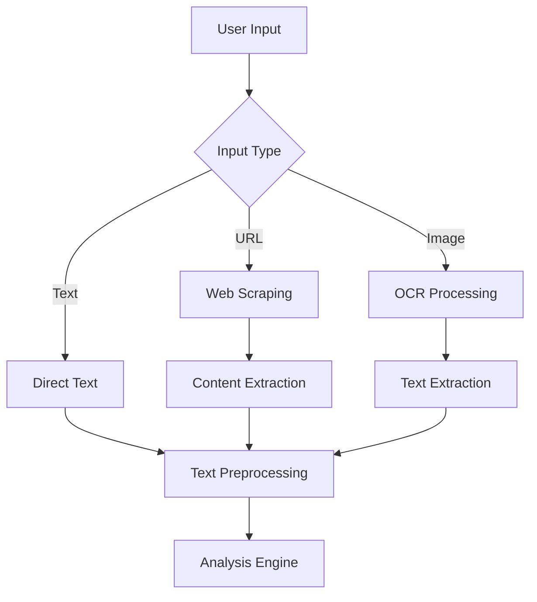
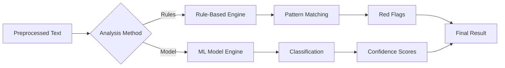

# 🔬 Technical Documentation - Fake News Detector

## 📋 Table of Contents

1. [System Architecture](#system-architecture)
2. [Data Pipeline](#data-pipeline)
3. [Detection Algorithms](#detection-algorithms)
4. [OCR Implementation](#ocr-implementation)
5. [API Endpoints](#api-endpoints)
6. [Database Schema](#database-schema)
7. [Performance Considerations](#performance-considerations)
8. [Security Measures](#security-measures)
9. [Error Handling](#error-handling)
10. [Future Improvements](#future-improvements)

## 🏗️ System Architecture

### High-Level Overview

```
┌─────────────────┐    ┌─────────────────┐    ┌─────────────────┐
│   Frontend UI   │    │   Backend API   │    │   External      │
│                 │    │                 │    │   Services      │
│ • Text Input    │◄──►│ • Express.js    │◄──►│ • Tesseract.js  │
│ • URL Input     │    │ • Multer        │    │ • Web Scraping  │
│ • Image Upload  │    │ • CORS          │    │ • NLP Libraries │
└─────────────────┘    └─────────────────┘    └─────────────────┘
                                │
                                ▼
                       ┌─────────────────┐
                       │   Core Services │
                       │                 │
                       │ • NLP Service   │
                       │ • Scraper       │
                       │ • Dataset Repo  │
                       └─────────────────┘
```

### Component Breakdown

#### Frontend Layer
- **HTML5**: Semantic markup with accessibility features
- **CSS3**: Modern styling with CSS Grid and Flexbox
- **Vanilla JavaScript**: No framework dependencies for lightweight performance
- **File API**: Drag-and-drop file upload functionality
- **Fetch API**: Asynchronous HTTP requests

#### Backend Layer
- **Express.js**: Web application framework
- **Multer**: File upload middleware
- **CORS**: Cross-origin resource sharing
- **JSON**: Data serialization format

#### Service Layer
- **NlpService**: Core NLP processing and analysis
- **ScraperService**: Web content extraction
- **DatasetRepository**: Training data management

## 🔄 Data Pipeline

### 1. Input Processing



### 2. Text Preprocessing Pipeline

```javascript
// Text preprocessing steps
1. Lowercase conversion
2. Tokenization (word splitting)
3. Stop word removal
4. Stemming (Porter Stemmer)
5. Feature extraction
```

### 3. Analysis Flow



## 🧠 Detection Algorithms

### Rules-Based Detection

The rules-based system uses heuristic patterns to identify fake news characteristics:

#### 1. Urgency Detection
```javascript
const urgencyWords = ["urgent", "immediately", "asap", "important", "help", "deadline"];
// Triggers red flag if any urgency words are found
```

#### 2. Financial Scam Detection
```javascript
const financialPattern = /(\$|usd|million|billion|wire\s*transfer|gift\s*card|bitcoin|crypto)/i;
// Detects money-related scam keywords
```

#### 3. Exclamation Analysis
```javascript
const exclamationCount = (text.match(/!/g) || []).length;
// Flags if excessive exclamation marks (≥2)
```

#### 4. Generic Greeting Detection
```javascript
const genericGreeting = /(dear\s+(friend|customer|user)|greetings\s+my\s+dear\s+friend)/i;
// Identifies common scam greeting patterns
```

#### 5. Link Analysis
```javascript
const urlPattern = /https?:\/\/\S+|www\.[^\s)]+/ig;
// Flags presence of suspicious links
```

#### 6. Sensational Language Detection
```javascript
const sensationalWords = [
  "shocking", "embarrassing", "disturbing", "you won't believe",
  "exposed", "destroyed", "goes viral", "must see", "epic fail"
];
// Identifies clickbait and sensational language
```

#### 7. ALL-CAPS Analysis
```javascript
const allCapsWords = words.filter(w => 
  /[A-Z]{3,}/.test(w) && !/^[A-Z]{1}[a-z]+$/.test(w)
);
// Flags excessive use of capital letters
```

#### Scoring Algorithm
```javascript
const score = Math.min(1, reasons.length * 0.2);
const predictedCategory = score >= 0.5 ? "fake" : "real";
```

### Model-Based Detection

The machine learning approach uses a Naive Bayes classifier:

#### 1. Text Preprocessing
```javascript
// Tokenization
const tokens = tokenizer.tokenize(text.toLowerCase());

// Stop word removal
const filtered = tokens.filter(t => !natural.stopwords.includes(t));

// Stemming
const stemmed = filtered.map(t => natural.PorterStemmer.stem(t));
```

#### 2. Training Process
```javascript
// Dataset loading and shuffling
const shuffled = [...dataset].sort(() => Math.random() - 0.5);

// Train/test split (80/20)
const splitIndex = Math.floor(shuffled.length * 0.8);
const trainSet = shuffled.slice(0, splitIndex);
const testSet = shuffled.slice(splitIndex);

// Model training
trainSet.forEach(item => {
  const doc = preprocess(item.text);
  classifier.addDocument(doc, item.label);
});
classifier.train();
```

#### 3. Classification
```javascript
const doc = preprocess(text);
const category = classifier.classify(doc);
const scores = classifier.getClassifications(doc);
```

### Sentiment Analysis

Both methods include VADER sentiment analysis:

```javascript
const sentiment = vader.SentimentIntensityAnalyzer.polarity_scores(text);
// Returns: { compound, pos, neu, neg }
```

## 📷 OCR Implementation

### Tesseract.js Integration

```javascript
// Image text extraction
const { data: { text } } = await Tesseract.recognize(
  file.buffer,        // Image buffer
  'eng',             // Language
  {
    logger: m => console.log(m)  // Progress logging
  }
);
```

### OCR Pipeline

1. **Image Upload**: Multer handles file upload and validation
2. **Format Validation**: Ensures only image files are processed
3. **Buffer Processing**: Converts uploaded file to buffer
4. **Text Extraction**: Tesseract.js processes the image
5. **Text Validation**: Ensures text was successfully extracted
6. **Analysis**: Extracted text goes through normal analysis pipeline

### Supported Image Formats
- JPEG/JPG
- PNG
- GIF
- BMP
- WebP
- TIFF

## 🔌 API Endpoints

### POST /api/analyze
**Purpose**: Analyze direct text input

**Request Body**:
```json
{
  "text": "Article text content",
  "method": "rules" | "model"
}
```

**Response**:
```json
{
  "text": "Original text",
  "predictedCategory": "fake" | "real",
  "rulesConfidence": 0.75,
  "redFlags": ["urgency words", "many exclamation marks"],
  "sentiment": {
    "compound": 0.1234,
    "pos": 0.234,
    "neu": 0.567,
    "neg": 0.199
  }
}
```

### POST /api/analyze-url
**Purpose**: Analyze content from URL

**Request Body**:
```json
{
  "url": "https://example.com/article",
  "method": "rules" | "model"
}
```

**Response**: Same as `/api/analyze` plus:
```json
{
  "url": "https://example.com/article",
  "textPreview": "First 400 characters of content"
}
```

### POST /api/analyze-image
**Purpose**: Analyze text extracted from image

**Request**: `multipart/form-data`
- `image`: Image file
- `method`: "rules" | "model"

**Response**: Same as `/api/analyze` plus:
```json
{
  "imageName": "uploaded-image.jpg",
  "extractedText": "Text extracted from image",
  "textPreview": "First 400 characters of extracted text"
}
```

## 🗄️ Database Schema

### Model Storage
```javascript
// Model is stored as JSON file
{
  "classifications": {
    "fake": { /* feature probabilities */ },
    "real": { /* feature probabilities */ }
  },
  "vocabulary": ["word1", "word2", ...],
  "totalDocuments": 1000,
  "documentsByCategory": {
    "fake": 500,
    "real": 500
  }
}
```

### Dataset Structure
```javascript
// Training data format
[
  {
    "text": "Article content...",
    "label": "fake" | "real"
  }
]
```

## ⚡ Performance Considerations

### Optimization Strategies

1. **Model Caching**: Trained models are saved to disk and loaded on startup
2. **Memory Management**: File uploads are processed in memory buffers
3. **Async Processing**: Non-blocking I/O for all operations
4. **Error Handling**: Graceful degradation on failures

### Performance Metrics

- **Rules Analysis**: ~50-100ms per article
- **Model Analysis**: ~200-500ms per article
- **OCR Processing**: ~2-5 seconds per image (depends on size/complexity)
- **URL Scraping**: ~1-3 seconds per URL

### Scalability Considerations

- **File Size Limits**: 10MB maximum upload size
- **Memory Usage**: Buffers are processed and released immediately
- **Concurrent Requests**: Express.js handles multiple requests asynchronously

## 🔒 Security Measures

### Input Validation
- File type validation (images only)
- File size limits (10MB max)
- Text length validation
- URL format validation

### Error Handling
- Graceful error responses
- No sensitive information in error messages
- Proper HTTP status codes

### CORS Configuration
```javascript
app.use(cors()); // Configured for development
// Production should specify allowed origins
```

## 🚨 Error Handling

### Common Error Scenarios

1. **Invalid File Type**
   ```json
   { "error": "Only image files are allowed" }
   ```

2. **File Too Large**
   ```json
   { "error": "File too large" }
   ```

3. **OCR Failure**
   ```json
   { "error": "No text could be extracted from the image" }
   ```

4. **URL Scraping Failure**
   ```json
   { "error": "Could not fetch content from URL" }
   ```

5. **Empty Text Input**
   ```json
   { "error": "text is required" }
   ```

### Error Response Format
```json
{
  "error": "Human-readable error message",
  "code": "ERROR_CODE", // Optional
  "details": {} // Optional additional details
}
```

## 🔮 Future Improvements

### Planned Enhancements

1. **Multi-language Support**
   - Support for multiple languages in OCR
   - Language-specific fake news patterns

2. **Advanced ML Models**
   - Deep learning models (BERT, RoBERTa)
   - Ensemble methods
   - Real-time model updates

3. **Enhanced Features**
   - Fact-checking integration
   - Source credibility analysis
   - Image manipulation detection

4. **Performance Optimizations**
   - Redis caching
   - Background job processing
   - CDN integration

5. **User Interface**
   - Batch processing
   - History tracking
   - Export functionality

### Technical Debt

1. **Testing**: Add comprehensive unit and integration tests
2. **Monitoring**: Implement logging and metrics collection
3. **Documentation**: API documentation with Swagger/OpenAPI
4. **CI/CD**: Automated testing and deployment pipeline

## 📊 Metrics and Monitoring

### Key Performance Indicators (KPIs)

- **Accuracy**: Model prediction accuracy
- **Response Time**: API response latency
- **Throughput**: Requests per second
- **Error Rate**: Failed requests percentage
- **OCR Success Rate**: Successful text extraction rate

### Monitoring Tools

- **Console Logging**: Basic error and progress logging
- **Health Check**: `/health` endpoint for service status
- **Error Tracking**: Comprehensive error handling and reporting

---

This technical documentation provides a comprehensive overview of the fake news detector system. For implementation details, refer to the source code in the respective service files.
